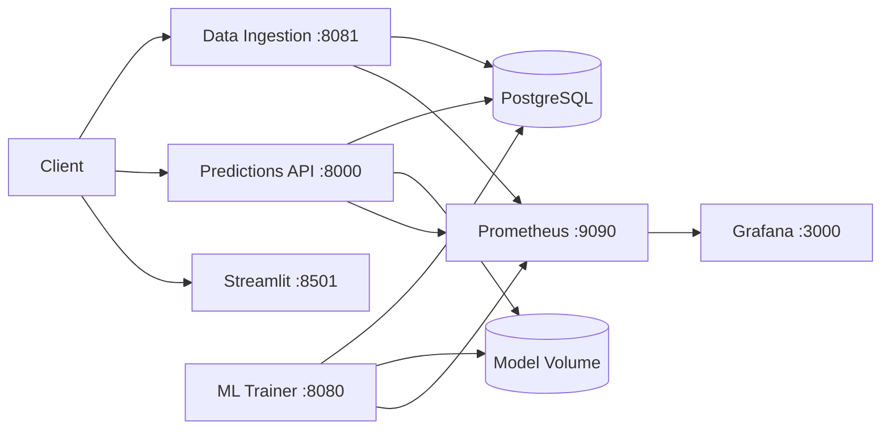

# AI Human Performance Intelligence Platform

[](https://github.com/<owner>/<repo>/actions/workflows/ci.yml)
[](https://github.com/<owner>/<repo>/actions/workflows/ci.yml)
[](https://github.com/<owner>/<repo>/actions/workflows/ci.yml)

> Replace `<owner>/<repo>` with your GitHub repository path.

- [English](#english)
- [Deutsch](#deutsch)

---

## English

### For Recruiters

This repository demonstrates senior-level engineering across software, data, ML, and platform:
- production microservices architecture (API, ingestion, ML trainer, dashboard)
- reliable cloud-native operations (Kubernetes, health probes, HPA, network policies)
- CI/CD + security controls (tests, image builds, Trivy scanning, deploy automation)
- observability-first design (Prometheus, Grafana, alerts, structured logging)

### Project Description

Production-ready platform for ingesting athlete performance data, training ML models, serving predictions, and monitoring operational health.

Microservices:
- `api` (predictions and health)
- `data-ingestion` (validated bulk/CSV intake)
- `ml-trainer` (training service)
- `dashboard` (Streamlit UI)
- `db` (PostgreSQL)
- `prometheus` + `grafana` (observability)

### Architecture Diagram



### Technologies Used

| Area | Technologies |
|---|---|
| Language | Python 3.11 |
| API | FastAPI, Uvicorn, Pydantic |
| Data/ML | Pandas, NumPy, Scikit-learn |
| Database | PostgreSQL, SQLAlchemy, PgBouncer |
| Dashboard | Streamlit |
| Monitoring | Prometheus, Grafana |
| DevOps | Docker, Docker Compose, Kubernetes, GitHub Actions, Trivy |

### Run Locally

Prerequisites:
- Docker + Docker Compose
- Python 3.11

1) Start the stack:

```bash
docker compose -f docker-compose.yml up -d --build
```

2) Seed sample data:

```bash
python scripts/init_data_via_api.py
```

3) Train model:

```bash
curl -X POST http://localhost:8000/train
```

4) Access:
- API docs: `http://localhost:8000/docs`
- Data Ingestion docs: `http://localhost:8081/docs`
- Dashboard: `http://localhost:8501`
- Prometheus: `http://localhost:9090`
- Grafana: `http://localhost:3000`

### Run in Kubernetes

```bash
kubectl apply -k k8s/
kubectl get pods -n perf-platform
kubectl get svc -n perf-platform
kubectl get ingress -n perf-platform
```

Included K8s features:
- liveness/readiness probes
- ConfigMap + Secret
- PVC for model artifacts
- HPA, PodDisruptionBudgets
- NetworkPolicies

### CI/CD

Pipeline: `.github/workflows/ci.yml`

Stages:
1. Lint + tests (`pytest`, coverage)
2. Compose validation
3. Build and push all microservice images to GHCR
4. Trivy image security scan
5. Optional SSH deployment with `docker-compose.deploy.yml`

Required deployment secrets:
- `DEPLOY_HOST`
- `DEPLOY_USER`
- `DEPLOY_SSH_KEY`
- `DEPLOY_PATH`

### Troubleshooting

- Containers not starting:
  - `docker compose -f docker-compose.yml ps`
  - `docker compose -f docker-compose.yml logs <service>`
- DB connectivity issues:
  - verify env vars and DB health (`pg_isready`)
- No metrics in Grafana:
  - check `/metrics` targets in `monitoring/prometheus.yml`
  - restart `prometheus` and `grafana`
- K8s CrashLoopBackOff:
  - `kubectl describe pod <pod> -n perf-platform`
  - `kubectl logs <pod> -n perf-platform`

### Production Hardening Checklist

- [ ] TLS end-to-end (ingress + internal where needed)
- [ ] Managed secrets (Vault / AWS / GCP)
- [ ] Automated PostgreSQL backups + restore drills
- [ ] Defined SLOs/SLIs + alerting policy
- [ ] RBAC and least privilege
- [ ] Signed images + continuous vulnerability scanning

---

## Deutsch

### Fur Recruiter

Dieses Repository zeigt Senior-Level Engineering uber Software, Daten, ML und Plattformbetrieb:
- produktionsreife Microservice-Architektur (API, Ingestion, ML-Trainer, Dashboard)
- cloud-native Zuverlassigkeit (Kubernetes, Health Probes, HPA, NetworkPolicies)
- CI/CD + Security-Kontrollen (Tests, Image-Builds, Trivy-Scans, Deployment-Automation)
- observability-first Ansatz (Prometheus, Grafana, Alerts, strukturiertes Logging)

### Projektbeschreibung

Produktionsreife Plattform zur Aufnahme von Leistungsdaten, zum Training von ML-Modellen, zur Bereitstellung von Vorhersagen und zur Überwachung des Systemzustands.

Microservices:
- `api` (Vorhersagen und Health-Checks)
- `data-ingestion` (validierte JSON/CSV-Datenaufnahme)
- `ml-trainer` (separater Trainingsdienst)
- `dashboard` (Streamlit-Oberfläche)
- `db` (PostgreSQL)
- `prometheus` + `grafana` (Monitoring/Observability)

### Architekturdiagramm


### Verwendete Technologien

| Bereich | Technologien |
|---|---|
| Sprache | Python 3.11 |
| API | FastAPI, Uvicorn, Pydantic |
| Daten/ML | Pandas, NumPy, Scikit-learn |
| Datenbank | PostgreSQL, SQLAlchemy, PgBouncer |
| Dashboard | Streamlit |
| Monitoring | Prometheus, Grafana |
| DevOps | Docker, Docker Compose, Kubernetes, GitHub Actions, Trivy |

### Lokal ausführen

Voraussetzungen:
- Docker + Docker Compose
- Python 3.11

1) Stack starten:

```bash
docker compose -f docker-compose.yml up -d --build
```

2) Beispieldaten laden:

```bash
python scripts/init_data_via_api.py
```

3) Modell trainieren:

```bash
curl -X POST http://localhost:8000/train
```

4) Zugriff:
- API-Doku: `http://localhost:8000/docs`
- Data-Ingestion-Doku: `http://localhost:8081/docs`
- Dashboard: `http://localhost:8501`
- Prometheus: `http://localhost:9090`
- Grafana: `http://localhost:3000`

### In Kubernetes ausführen

```bash
kubectl apply -k k8s/
kubectl get pods -n perf-platform
kubectl get svc -n perf-platform
kubectl get ingress -n perf-platform
```

Enthaltene K8s-Funktionen:
- Liveness-/Readiness-Probes
- ConfigMap + Secret
- PVC für Modellartefakte
- HPA, PodDisruptionBudgets
- NetworkPolicies

### CI/CD

Pipeline: `.github/workflows/ci.yml`

Stufen:
1. Lint + Tests (`pytest`, Coverage)
2. Compose-Validierung
3. Build & Push aller Images nach GHCR
4. Sicherheits-Scan mit Trivy
5. Optionales SSH-Deployment über `docker-compose.deploy.yml`

Benötigte Secrets:
- `DEPLOY_HOST`
- `DEPLOY_USER`
- `DEPLOY_SSH_KEY`
- `DEPLOY_PATH`

### Fehlerbehebung

- Container starten nicht:
  - `docker compose -f docker-compose.yml ps`
  - `docker compose -f docker-compose.yml logs <service>`
- DB-Verbindungsprobleme:
  - Umgebungsvariablen und `pg_isready` prüfen
- Keine Metriken in Grafana:
  - Prometheus-Targets in `monitoring/prometheus.yml` prüfen
  - `prometheus` und `grafana` neu starten
- K8s CrashLoopBackOff:
  - `kubectl describe pod <pod> -n perf-platform`
  - `kubectl logs <pod> -n perf-platform`

### Produktions-Härtungs-Checkliste

- [ ] TLS durchgängig aktivieren
- [ ] Secrets-Manager verwenden (Vault / AWS / GCP)
- [ ] Automatische PostgreSQL-Backups + Restore-Tests
- [ ] SLOs/SLIs definieren und Alarmierung konfigurieren
- [ ] RBAC und Least-Privilege-Prinzip
- [ ] Signierte Images + kontinuierliche Schwachstellen-Scans

---

## License

MIT
