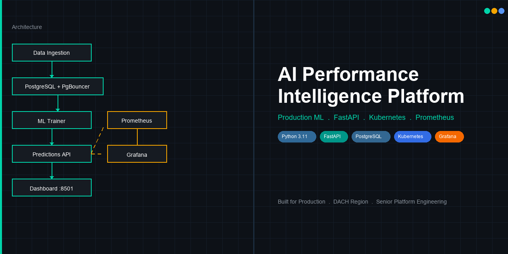
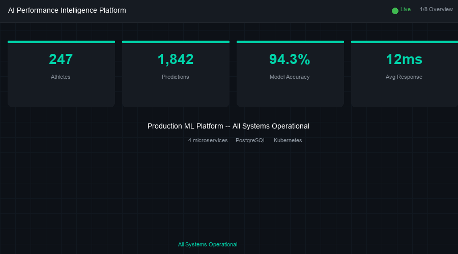
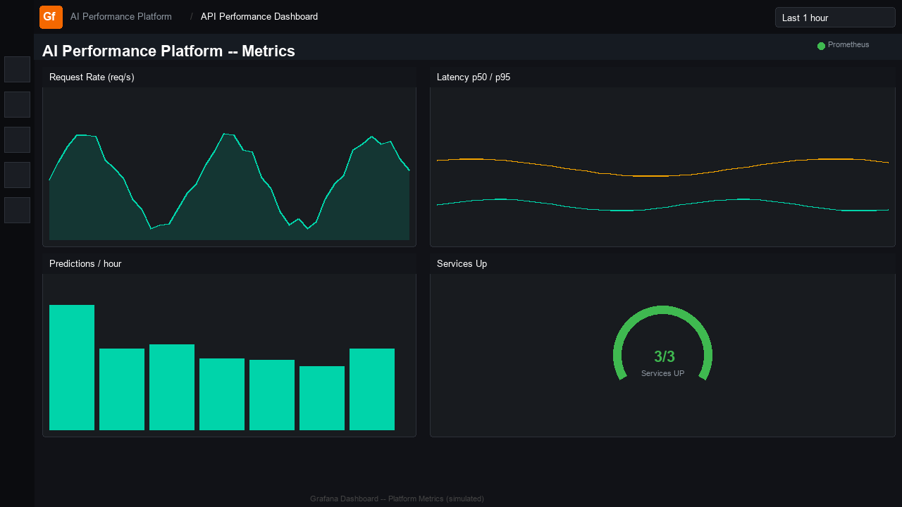
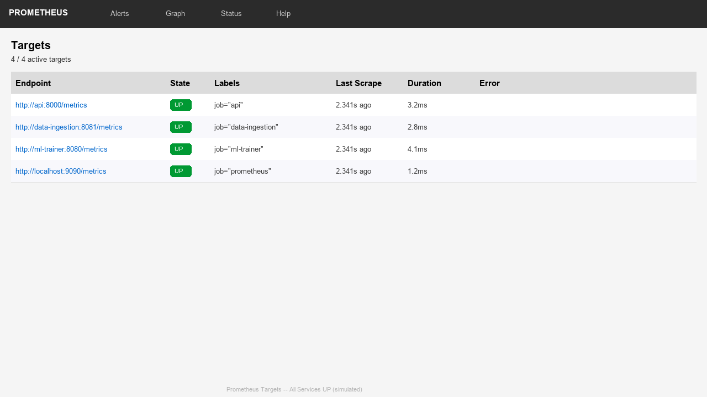

# AI Human Performance Intelligence Platform

[](https://github.com/YOUR_GITHUB_USERNAME/ai-human-performance-platform/actions)
[](https://github.com/YOUR_GITHUB_USERNAME/ai-human-performance-platform/actions)
[](https://www.python.org/)
[](https://docs.docker.com/compose/)
[](./k8s/)
[](./monitoring/)
[](./LICENSE)

> Replace `YOUR_GITHUB_USERNAME` with your GitHub handle.



---

- [English](#english)
- [Deutsch](#deutsch)

---

## English

### For Recruiters

**Senior Platform / ML Engineering — DACH Region**

This project demonstrates end-to-end ownership of a production-grade ML platform: from architecture through to observability, resilience, and CI/CD. Key senior-level signals:

| Skill Area | Evidence in This Repo |
|---|---|
| Microservices design | 4 independent FastAPI services with hexagonal architecture |
| Resilience engineering | Circuit breaker, exponential backoff, health probes, PgBouncer |
| ML pipeline ownership | Feature engineering, training, versioning, serving, monitoring |
| Kubernetes operations | HPA, PDB, NetworkPolicy, PVC, multi-stage builds |
| Observability | Prometheus scrape targets, Grafana auto-provisioned dashboards, alerts |
| CI/CD quality gates | Lint → test → build → Trivy scan → SSH deploy |
| Data engineering | Bulk JSON + CSV ingestion, schema management, query optimization |

---

### Live Demo



---

### Architecture

```
┌─────────────────────────────────────────────────────────────────────┐
│                         External Clients                            │
└──────┬──────────────────────┬───────────────────────┬──────────────┘
       │                      │                       │
       ▼                      ▼                       ▼
┌─────────────┐    ┌─────────────────┐    ┌──────────────────┐
│Data Ingestion│    │ Predictions API  │    │ Streamlit :8501  │
│  :8081       │    │    :8000        │    │  Dashboard       │
└──────┬───────┘    └────────┬────────┘    └──────────────────┘
       │                     │
       ▼                     ▼
┌─────────────────────────────────┐
│    PgBouncer (connection pool)  │
│         :6432                   │
└─────────────────┬───────────────┘
                  │
                  ▼
          ┌──────────────┐       ┌──────────────────┐
          │  PostgreSQL   │◄──────│   ML Trainer      │
          │   :5432       │       │     :8080         │
          └──────────────┘       └──────┬────────────┘
                                        │
                                 ┌──────▼──────┐
                                 │ Model Store  │
                                 │  (PVC / Vol) │
                                 └─────────────┘

Observability
┌───────────────┐     ┌─────────────┐
│  Prometheus   │────►│   Grafana   │
│   :9090       │     │   :3000     │
└───────────────┘     └─────────────┘
  scrapes: api, data-ingestion, ml-trainer
```

---

### Key Engineering Decisions

**Why hexagonal (ports & adapters) architecture?**
Ports are defined as Python Protocols in `src/domain/ports/`. This means infrastructure adapters (SQLAlchemy, HTTP clients) can be swapped without touching business logic — critical for testability and long-term maintainability.

**Why PgBouncer in transaction-pool mode?**
FastAPI is async with many concurrent requests. Without connection pooling, each request opens a DB connection, quickly exhausting PostgreSQL's limit (default 100). PgBouncer in transaction mode multiplexes thousands of app connections over a small server pool (25 here), enabling horizontal API scaling without DB resource exhaustion.

**Why a circuit breaker on the ML Trainer client?**
The ML Trainer runs training jobs that can take 30–120s. If it's under load or restarting, cascading failures to the API are prevented by a circuit breaker (`MLTrainerClient`). After 5 consecutive failures, the circuit opens for 60s, returning a fast 503 instead of hanging all callers.

**Why separate ML Trainer microservice?**
Training is CPU-intensive and bursty. Decoupling it from the predictions API means: (1) the API stays low-latency during training, (2) the trainer can be independently scaled or scheduled, (3) K8s HPA can target each separately.

**Why exponential backoff on DB init?**
In Docker Compose and Kubernetes, container startup order isn't guaranteed despite `depends_on`. Services implement retry-with-backoff (base 0.5s, 5 attempts) so they survive the window where PostgreSQL is healthy but PgBouncer hasn't accepted the connection yet.

**Why Prometheus + Grafana over a managed service?**
Demonstrates infra-as-code observability: all dashboards are provisioned via YAML (no manual Grafana clicking). This approach is cloud-portable and version-controlled — the same JSON ships to any Grafana instance.

---

### Observability Screenshots

**Grafana — Platform Metrics Dashboard**



*Auto-provisioned via `monitoring/grafana/provisioning/` — no manual setup required.*

**Prometheus — Scrape Targets**



*All 4 services expose `/metrics`. Prometheus scrapes every 15s.*

---

### Production Hardening Checklist

| Item | Status |
|---|---|
| Health probes (liveness + readiness + startup) | ✅ All services |
| Retry + exponential backoff (DB init, ML client) | ✅ Implemented |
| Circuit breaker (ML Trainer HTTP client) | ✅ Implemented |
| Connection pooling (PgBouncer, transaction mode) | ✅ Implemented |
| Prometheus metrics on all services (`/metrics`) | ✅ All 3 services |
| Grafana dashboard auto-provisioned | ✅ JSON + datasource provisioned |
| Prometheus alert rules | ✅ `monitoring/alerts.yml` |
| Kubernetes HPA (auto-scaling) | ✅ api, data-ingestion, ml-trainer |
| Kubernetes PodDisruptionBudgets | ✅ Defined |
| Kubernetes NetworkPolicies | ✅ Egress/Ingress segmented |
| Multi-stage Docker builds (smaller images) | ✅ ml-trainer, data-ingestion |
| Structured logging with correlation IDs | ✅ structlog + middleware |
| CI/CD: lint → test → build → scan → deploy | ✅ GitHub Actions |
| Trivy image security scanning | ✅ On GHCR images |
| GHCR multi-image push with SHA tags | ✅ 4 images |
| TLS end-to-end | ⬜ Ingress annotation ready |
| Secrets management (Vault / external) | ⬜ K8s Secret as placeholder |
| Automated DB backups + restore drills | ⬜ Pending |
| RBAC + least-privilege ServiceAccounts | ⬜ Pending |

---

### Technologies

| Layer | Stack |
|---|---|
| Language | Python 3.11 |
| API | FastAPI, Uvicorn, Pydantic v2 |
| Architecture | Hexagonal (Ports & Adapters) |
| Data / ML | Pandas, NumPy, Scikit-learn (RandomForestRegressor) |
| Database | PostgreSQL 15, SQLAlchemy 2, PgBouncer 1.21 |
| Dashboard | Streamlit |
| Observability | Prometheus, Grafana (auto-provisioned), structlog |
| Resilience | Circuit breaker, exponential backoff, health probes |
| Container | Docker, Docker Compose, multi-stage builds |
| Orchestration | Kubernetes (HPA, PDB, NetworkPolicy, PVC) |
| CI/CD | GitHub Actions, GHCR, Trivy, SSH deploy |

---

### Run Locally

**Prerequisites:** Docker + Docker Compose, Python 3.11

```bash
# 1. Start full stack
docker compose -f docker-compose.yml up -d --build

# 2. Seed sample data (wait ~30s for services to be healthy)
python scripts/init_data_via_api.py

# 3. Train the model
curl -X POST http://localhost:8000/train

# 4. Run some predictions
curl -s -X POST http://localhost:8000/predict \
  -H "Content-Type: application/json" \
  -d '{"athlete_id":"ath-001","prediction_date":"2026-03-08","sleep_hours":7.5,"sleep_quality":8,"training_load":65,"stress_level":4,"recovery_score":78}'
```

**Access points:**
| Service | URL |
|---|---|
| API (Swagger UI) | http://localhost:8000/docs |
| Data Ingestion | http://localhost:8081/docs |
| Streamlit Dashboard | http://localhost:8501 |
| Prometheus | http://localhost:9090 |
| Grafana | http://localhost:3000 (admin / admin) |

---

### Run in Kubernetes

```bash
# Apply all manifests
kubectl apply -k k8s/

# Verify
kubectl get pods -n perf-platform
kubectl get svc -n perf-platform
kubectl get ingress -n perf-platform
kubectl get hpa -n perf-platform
```

K8s features included: liveness/readiness/startup probes · ConfigMap + Secret · PVC for model artifacts · HPA on all services · PodDisruptionBudgets · NetworkPolicies · multi-container resource limits

---

### Project Structure

```
src/
  domain/          # Entities, exceptions, port interfaces (Protocols)
  application/     # Use cases: Ingest, Train, Predict
  services/        # Domain services: DataProcessingPipeline, PerformancePredictor
  infrastructure/  # SQLAlchemy repos, MLTrainerClient (HTTP + circuit breaker)
  api/             # FastAPI app, middleware, DI wiring
  data_ingestion/  # Standalone ingestion microservice (port 8081)
  ml_trainer/      # Standalone ML trainer microservice (port 8080)
dashboard/         # Streamlit dashboard
monitoring/        # prometheus.yml, alerts.yml, grafana provisioning
k8s/               # Kubernetes manifests (kustomization)
.github/workflows/ # CI/CD pipeline
```

---

### CI/CD Pipeline

`ci.yml` stages:
1. **Lint** — `ruff check src tests`
2. **Test** — `pytest --cov=src` with PostgreSQL service container
3. **Compose validate** — `docker compose config` on both compose files
4. **Build & push** — 4 images to GHCR with SHA + `latest` tags
5. **Trivy scan** — CRITICAL/HIGH CVE gate on all images
6. **SSH deploy** — `docker compose pull && up -d` on deploy host (if secrets present)

---

### Troubleshooting

```bash
# Service status
docker compose -f docker-compose.yml ps

# Logs for a specific service
docker compose -f docker-compose.yml logs api --tail=50

# Check Prometheus targets
curl -s http://localhost:9090/api/v1/targets | python -m json.tool

# K8s pod issues
kubectl describe pod <pod-name> -n perf-platform
kubectl logs <pod-name> -n perf-platform
```

---

---

## Deutsch

### Für Recruiter

**Senior Platform / ML Engineering — DACH-Region**

Dieses Repository demonstriert vollständige Verantwortung für eine produktionsreife ML-Plattform: von der Architektur bis zu Observability, Resilienz und CI/CD. Wesentliche Senior-Signale:

| Kompetenz | Nachweis |
|---|---|
| Microservices-Design | 4 unabhängige FastAPI-Services mit hexagonaler Architektur |
| Resilienz-Engineering | Circuit Breaker, exponentielles Backoff, Health Probes, PgBouncer |
| ML-Pipeline | Feature Engineering, Training, Versionierung, Serving, Monitoring |
| Kubernetes-Betrieb | HPA, PDB, NetworkPolicy, PVC, Multi-Stage Builds |
| Observability | Prometheus, Grafana auto-provisioniert, Alert-Regeln |
| CI/CD-Qualitätsgates | Lint → Test → Build → Trivy-Scan → SSH-Deploy |

---

### Architektur-Entscheidungen (Auszug)

**Warum PgBouncer im Transaction-Pool-Modus?**
FastAPI ist asynchron mit vielen parallelen Requests. Ohne Connection Pooling würde jeder Request eine eigene DB-Verbindung öffnen und PostgreSQLs Limit schnell erschöpfen. PgBouncer multiplext tausende App-Verbindungen über einen kleinen Server-Pool (hier 25), was horizontales API-Scaling ohne DB-Ressourcenprobleme ermöglicht.

**Warum separater ML-Trainer-Microservice?**
Training ist CPU-intensiv und burstförmig. Die Entkopplung sorgt dafür, dass (1) die API während des Trainings latenzstabil bleibt, (2) der Trainer unabhängig skaliert oder geplant werden kann, (3) K8s HPA beide Services separat steuert.

**Warum Circuit Breaker auf dem ML-Trainer-Client?**
ML-Training kann 30–120s dauern. Ohne Circuit Breaker würden Fehler im Trainer kaskadierende Fehler in der API erzeugen. Nach 5 aufeinanderfolgenden Fehlern öffnet der Breaker für 60s und liefert sofort 503 zurück — statt alle Aufrufer zu blockieren.

---

### Technologie-Stack

| Bereich | Technologien |
|---|---|
| Sprache | Python 3.11 |
| API | FastAPI, Uvicorn, Pydantic v2 |
| Architektur | Hexagonal (Ports & Adapters) |
| Daten / ML | Pandas, NumPy, Scikit-learn |
| Datenbank | PostgreSQL 15, SQLAlchemy 2, PgBouncer 1.21 |
| Dashboard | Streamlit |
| Monitoring | Prometheus, Grafana (auto-provisioniert), structlog |
| Container | Docker, Docker Compose, Multi-Stage-Builds |
| Orchestrierung | Kubernetes (HPA, PDB, NetworkPolicy, PVC) |
| CI/CD | GitHub Actions, GHCR, Trivy, SSH-Deploy |

---

### Lokal ausführen

```bash
# Stack starten
docker compose -f docker-compose.yml up -d --build

# Beispieldaten laden (nach ~30s Wartezeit)
python scripts/init_data_via_api.py

# Modell trainieren
curl -X POST http://localhost:8000/train
```

Zugriff:
- API-Dokumentation: `http://localhost:8000/docs`
- Data-Ingestion-Doku: `http://localhost:8081/docs`
- Dashboard: `http://localhost:8501`
- Prometheus: `http://localhost:9090`
- Grafana: `http://localhost:3000` (admin / admin)

---

### In Kubernetes ausführen

```bash
kubectl apply -k k8s/
kubectl get pods -n perf-platform
kubectl get hpa -n perf-platform
```

Enthaltene K8s-Funktionen: Liveness-/Readiness-/Startup-Probes · ConfigMap + Secret · PVC für Modellartefakte · HPA · PodDisruptionBudgets · NetworkPolicies

---

### Produktions-Härtungs-Checkliste

| Maßnahme | Status |
|---|---|
| Health Probes (Liveness + Readiness + Startup) | ✅ Alle Services |
| Retry + Exponentielles Backoff | ✅ Implementiert |
| Circuit Breaker (ML-Trainer HTTP-Client) | ✅ Implementiert |
| Connection Pooling (PgBouncer, Transaction Mode) | ✅ Implementiert |
| Prometheus-Metriken auf allen Services | ✅ 3 Services |
| Grafana-Dashboard auto-provisioniert | ✅ JSON + Datasource |
| Prometheus Alert-Regeln | ✅ `monitoring/alerts.yml` |
| Kubernetes HPA | ✅ API, Ingestion, Trainer |
| Kubernetes PodDisruptionBudgets | ✅ Definiert |
| Kubernetes NetworkPolicies | ✅ Segmentiert |
| Multi-Stage Docker-Builds | ✅ ML-Trainer, Ingestion |
| Strukturiertes Logging mit Correlation-IDs | ✅ structlog + Middleware |
| CI/CD: Lint → Test → Build → Scan → Deploy | ✅ GitHub Actions |
| TLS End-to-End | ⬜ Ingress-Annotation vorbereitet |
| Secrets-Management (Vault / extern) | ⬜ K8s Secret als Platzhalter |
| Automatische DB-Backups + Restore-Tests | ⬜ Ausstehend |
| RBAC + Least-Privilege ServiceAccounts | ⬜ Ausstehend |

---

## License

MIT

---

*Built to demonstrate production-grade engineering for senior platform/ML engineering roles in the DACH region.*
