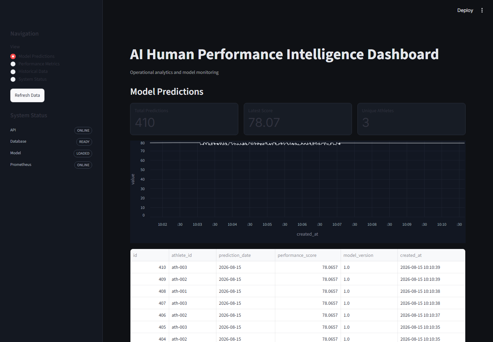
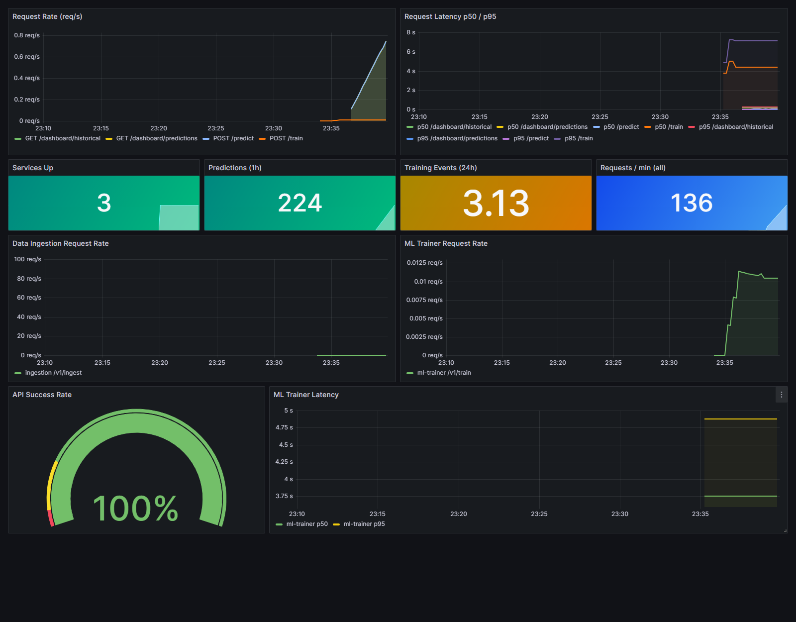
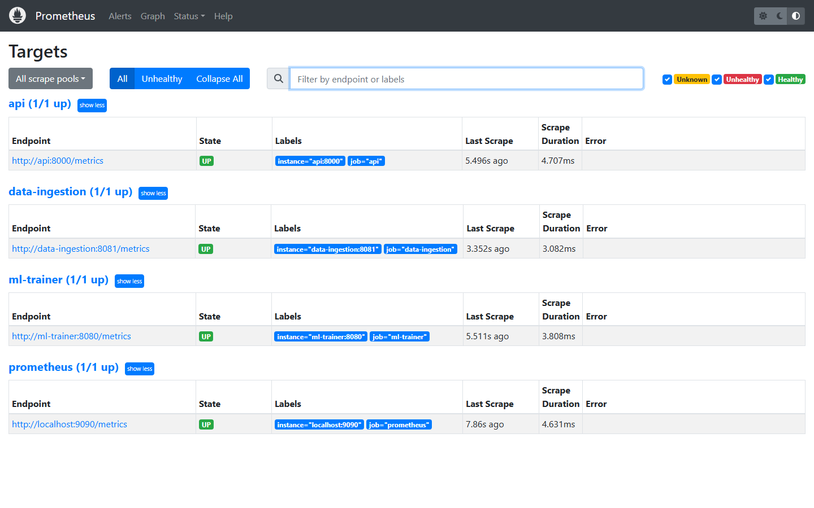

# AI Human Performance Intelligence Platform

[](https://github.com/Shavershian96/ai-human-performance-intelligence-platform/actions)
[](https://github.com/Shavershian96/ai-human-performance-intelligence-platform/actions)
[](https://github.com/Shavershian96/ai-human-performance-intelligence-platform/actions)
[](https://www.python.org/)
[](https://docs.docker.com/compose/)
[](./k8s/)
[](./monitoring/)
[](./LICENSE)

---

- [English](#english)
- [Deutsch](#deutsch)

---

## English

### For Recruiters

**Senior Platform / ML Engineering — DACH Region**

This project demonstrates end-to-end ownership of a production-grade ML platform: from architecture through to observability, resilience, and CI/CD. Key senior-level signals:

| Skill Area | Evidence in This Repo |
|---|---|
| Microservices design | 3 independent FastAPI services (API, ingestion, trainer) plus a Streamlit dashboard, on a hexagonal architecture |
| Resilience engineering | Circuit breaker, exponential backoff, health probes, PgBouncer |
| ML pipeline ownership | Feature engineering, training, versioning, serving, monitoring; evaluated against a mean baseline with 5-fold CV |
| Kubernetes operations | HPA, PDB, NetworkPolicy, PVC, multi-stage builds |
| Observability | Prometheus scrape targets, Grafana auto-provisioned dashboards, alerts |
| CI/CD quality gates | Lint → mypy → test → build → Trivy scan → SSH deploy |
| Testing | 71 tests at 77% coverage, including circuit-breaker and backoff behaviour |
| Data engineering | Bulk JSON + CSV ingestion, schema management, query optimization |

---

### Dashboard



*Captured from the running stack: predictions served from the trained model, with API, database, model and Prometheus all reporting healthy.*

---

### Architecture

```
┌─────────────────────────────────────────────────────────────────────┐
│                         External Clients                            │
└──────┬──────────────────────┬───────────────────────┬──────────────┘
       │                      │                       │
       ▼                      ▼                       ▼
┌─────────────┐    ┌─────────────────┐    ┌──────────────────┐
│Data Ingestion│    │ Predictions API  │    │ Streamlit :8501  │
│  :8081       │    │    :8000        │    │  Dashboard       │
└──────┬───────┘    └────────┬────────┘    └──────────────────┘
       │                     │
       ▼                     ▼
┌─────────────────────────────────┐
│    PgBouncer (connection pool)  │
│         :6432                   │
└─────────────────┬───────────────┘
                  │
                  ▼
          ┌──────────────┐       ┌──────────────────┐
          │  PostgreSQL   │◄──────│   ML Trainer      │
          │   :5432       │       │     :8080         │
          └──────────────┘       └──────┬────────────┘
                                        │
                                 ┌──────▼──────┐
                                 │ Model Store  │
                                 │  (PVC / Vol) │
                                 └─────────────┘

Observability
┌───────────────┐     ┌─────────────┐
│  Prometheus   │────►│   Grafana   │
│   :9090       │     │   :3000     │
└───────────────┘     └─────────────┘
  scrapes: api, data-ingestion, ml-trainer
```

---

### The Model

> **The dataset is synthetic.** It is generated by
> [`scripts/generate_dataset.py`](scripts/generate_dataset.py) — 40 athletes × 120 days
> = 4,800 rows — and is not measured from real people. Nothing here is a claim about
> human physiology. It exists so the metrics below are computed on enough data to mean
> something, and so anyone cloning the repo reproduces them exactly with `--seed 42`.

The generator is not random noise. Load follows periodised build/recovery blocks;
acute and chronic workloads produce an acute:chronic ratio that drives performance as
an **inverted U** — undertraining and load spikes both cost, a ratio near 1.0 is best.
Sleep, stress, resting heart rate and HRV are driven by recent load plus per-athlete
baselines, so the features are correlated the way wearable data is. Gaussian noise on
the target sets an irreducible error floor, so a perfect score would signal leakage
rather than success.

**RandomForestRegressor**, 9 features (7 raw + 2 engineered), 80/20 split:

| Metric | Model | Mean baseline |
|---|---|---|
| Test R² | **0.508** | −0.002 |
| Test MAE | **4.33** | 6.29 |
| Test RMSE | 5.50 | — |
| 5-fold CV R² (train) | **0.500 ± 0.021** | — |

The baseline row is always-predict-the-mean. Without it an R² is not interpretable;
the model has to beat it to be worth serving, and here it cuts MAE by **31%**. The
cross-validated score matches the hold-out score to within a hundredth, which is the
check that the split was not lucky.

Train R² is 0.760 against 0.508 on test — the forest overfits, as forests do. That gap
is reported rather than hidden.

Feature importances land where the generator put the signal:

| Feature | Importance |
|---|---|
| `recovery_score` | 0.559 |
| `hrv_filled` | 0.137 |
| `resting_heart_rate_filled` | 0.076 |
| `sleep_hours` | 0.045 |
| `sleep_quality` | 0.042 |
| others (5) | 0.141 |

**Known limitation:** the acute:chronic ratio drives the target but is not one of the
model's features — it needs a rolling window the current per-row pipeline does not
compute. Part of the unexplained variance is therefore structural, not just noise.
Adding rolling load features is the obvious next step.

---

### Key Engineering Decisions

**Why hexagonal (ports & adapters) architecture?**
Ports are defined as Python Protocols in `src/domain/ports/`. This means infrastructure adapters (SQLAlchemy, HTTP clients) can be swapped without touching business logic — critical for testability and long-term maintainability.

**Why PgBouncer in transaction-pool mode?**
FastAPI is async with many concurrent requests. Without connection pooling, each request opens a DB connection, quickly exhausting PostgreSQL's limit (default 100). PgBouncer in transaction mode multiplexes thousands of app connections over a small server pool (25 here), enabling horizontal API scaling without DB resource exhaustion.

**Why a circuit breaker on the ML Trainer client?**
The ML Trainer runs training jobs that can take 30–120s. If it's under load or restarting, cascading failures to the API are prevented by a circuit breaker (`MLTrainerClient`). After 5 consecutive failures, the circuit opens for 60s, returning a fast 503 instead of hanging all callers.

**Why separate ML Trainer microservice?**
Training is CPU-intensive and bursty. Decoupling it from the predictions API means: (1) the API stays low-latency during training, (2) the trainer can be independently scaled or scheduled, (3) K8s HPA can target each separately.

**Why exponential backoff on DB init?**
In Docker Compose and Kubernetes, container startup order isn't guaranteed despite `depends_on`. Services implement retry-with-backoff (base 0.5s, 5 attempts) so they survive the window where PostgreSQL is healthy but PgBouncer hasn't accepted the connection yet.

**Why Prometheus + Grafana over a managed service?**
Demonstrates infra-as-code observability: all dashboards are provisioned via YAML (no manual Grafana clicking). This approach is cloud-portable and version-controlled — the same JSON ships to any Grafana instance.

---

### Observability

**Grafana — Platform Metrics Dashboard**



*Auto-provisioned from `monitoring/grafana/provisioning/` — no manual setup required. Captured from the running stack while it served prediction traffic across four training runs.*

**Prometheus — Scrape Targets**



*All four scrape jobs UP — `api`, `data-ingestion`, `ml-trainer` and Prometheus itself — at the 15s interval set in `monitoring/prometheus.yml`.*

---

### Production Hardening Checklist

| Item | Status |
|---|---|
| Health probes (liveness + readiness + startup) | ✅ All services |
| Retry + exponential backoff (DB init, ML client) | ✅ Implemented |
| Circuit breaker (ML Trainer HTTP client) | ✅ Implemented |
| Connection pooling (PgBouncer, transaction mode) | ✅ Implemented |
| Prometheus metrics (`/metrics`) | ✅ api, data-ingestion, ml-trainer (the Streamlit dashboard is not instrumented) |
| Grafana dashboard auto-provisioned | ✅ JSON + datasource provisioned |
| Prometheus alert rules | ✅ `monitoring/alerts.yml` |
| Kubernetes HPA (auto-scaling) | ✅ api, data-ingestion, ml-trainer |
| Kubernetes PodDisruptionBudgets | ✅ Defined |
| Kubernetes NetworkPolicies | ✅ Egress/Ingress segmented |
| Multi-stage Docker builds (smaller images) | ✅ ml-trainer, data-ingestion |
| Containers run as an unprivileged user | ✅ All 4 images (uid 10001, no root) |
| Structured logging with correlation IDs | ✅ structlog + middleware |
| CI/CD: lint → type check → test → build → scan → deploy | ✅ GitHub Actions |
| Static type checking | ✅ `mypy src/` clean, enforced in CI |
| Test suite | ✅ 71 tests, 77% coverage, no live DB required |
| Trivy image security scanning | ✅ On GHCR images |
| GHCR multi-image push with SHA tags | ✅ 4 images |
| TLS end-to-end | ⬜ Ingress annotation ready |
| Secrets management (Vault / external) | ⬜ K8s Secret as placeholder |
| Automated DB backups + restore drills | ⬜ Pending |
| RBAC + least-privilege ServiceAccounts | ⬜ Pending |

---

### Technologies

| Layer | Stack |
|---|---|
| Language | Python 3.11 |
| API | FastAPI, Uvicorn, Pydantic v2 |
| Architecture | Hexagonal (Ports & Adapters) |
| Data / ML | Pandas, NumPy, Scikit-learn (RandomForestRegressor) |
| Database | PostgreSQL 15, SQLAlchemy 2, PgBouncer 1.21 |
| Dashboard | Streamlit |
| Observability | Prometheus, Grafana (auto-provisioned), structlog |
| Resilience | Circuit breaker, exponential backoff, health probes |
| Container | Docker, Docker Compose, multi-stage builds |
| Orchestration | Kubernetes (HPA, PDB, NetworkPolicy, PVC) |
| CI/CD | GitHub Actions, GHCR, Trivy, SSH deploy |

---

### Run Locally

**Prerequisites:** Docker + Docker Compose, Python 3.11

```bash
# 1. Start full stack
docker compose -f docker-compose.yml up -d --build

# 2. Seed the dataset (wait ~30s for services to be healthy)
#    data/sample_data.csv is committed; regenerate it with
#    `python scripts/generate_dataset.py` if you want different parameters.
python scripts/init_data_via_api.py
# -> Ingested 4800 records via Data Ingestion API

# 3. Train the model
curl -X POST http://localhost:8000/train
# -> {"status":"completed","samples_used":4800,"metrics":{"test_r2":0.508, ...}}

# 4. Run some predictions
curl -s -X POST http://localhost:8000/predict \
  -H "Content-Type: application/json" \
  -d '{"athlete_id":"ath-001","prediction_date":"2026-08-15","sleep_hours":7.8,"sleep_quality":8.4,"training_load":265,"stress_level":4.2,"recovery_score":8.1,"resting_heart_rate":56,"hrv":68}'
# -> {"athlete_id":"ath-001","prediction_date":"2026-08-15","performance_score":...,"model_version":"1.0"}
```

**Access points:**
| Service | URL |
|---|---|
| API (Swagger UI) | http://localhost:8000/docs |
| Data Ingestion | http://localhost:8081/docs |
| Streamlit Dashboard | http://localhost:8501 |
| Prometheus | http://localhost:9090 |
| Grafana | http://localhost:3000 (admin / admin) |

---

### Run in Kubernetes

```bash
# Apply all manifests
kubectl apply -k k8s/

# Verify
kubectl get pods -n perf-platform
kubectl get svc -n perf-platform
kubectl get ingress -n perf-platform
kubectl get hpa -n perf-platform
```

K8s features included: liveness/readiness/startup probes · ConfigMap + Secret · PVC for model artifacts · HPA on all services · PodDisruptionBudgets · NetworkPolicies · multi-container resource limits

---

### Project Structure

```
src/
  domain/          # Entities, exceptions, port interfaces (Protocols)
  application/     # Use cases: Ingest, Train, Predict
  services/        # Domain services: DataProcessingPipeline, PerformancePredictor
  infrastructure/  # SQLAlchemy repos, MLTrainerClient (HTTP + circuit breaker)
  api/             # FastAPI app, middleware, DI wiring
  data_ingestion/  # Standalone ingestion microservice (port 8081)
  ml_trainer/      # Standalone ML trainer microservice (port 8080)
dashboard/         # Streamlit dashboard
monitoring/        # prometheus.yml, alerts.yml, grafana provisioning
k8s/               # Kubernetes manifests (kustomization)
scripts/           # Data seeding and README screenshot capture
.github/workflows/ # CI/CD pipeline
```

The screenshots in this README are produced by `scripts/capture_screenshots.py`
against a running stack, so they can be regenerated and verified rather than
taken on trust.

---

### CI/CD Pipeline

`ci.yml` stages:
1. **Lint** — `ruff check src tests scripts dashboard`
2. **Type check** — `mypy src/`, clean across all 50 source files
3. **Test** — `pytest --cov=src` with PostgreSQL service container
4. **Compose validate** — `docker compose config` on both compose files
5. **Build & push** — 4 images to GHCR with SHA + `latest` tags
6. **Trivy scan** — CRITICAL/HIGH CVE gate on all images, limited to vulnerabilities with a fix available
7. **SSH deploy** — `docker compose pull && up -d` on deploy host (if secrets present)

---

### Troubleshooting

```bash
# Service status
docker compose -f docker-compose.yml ps

# Logs for a specific service
docker compose -f docker-compose.yml logs api --tail=50

# Check Prometheus targets
curl -s http://localhost:9090/api/v1/targets | python -m json.tool

# K8s pod issues
kubectl describe pod <pod-name> -n perf-platform
kubectl logs <pod-name> -n perf-platform
```

---

---

## Deutsch

### Für Recruiter

**Senior Platform / ML Engineering — DACH-Region**

Dieses Repository demonstriert vollständige Verantwortung für eine produktionsreife ML-Plattform: von der Architektur bis zu Observability, Resilienz und CI/CD. Wesentliche Senior-Signale:

| Kompetenz | Nachweis |
|---|---|
| Microservices-Design | 3 unabhängige FastAPI-Services (API, Ingestion, Trainer) plus Streamlit-Dashboard, hexagonale Architektur |
| Resilienz-Engineering | Circuit Breaker, exponentielles Backoff, Health Probes, PgBouncer |
| ML-Pipeline | Feature Engineering, Training, Versionierung, Serving, Monitoring |
| Kubernetes-Betrieb | HPA, PDB, NetworkPolicy, PVC, Multi-Stage Builds |
| Observability | Prometheus, Grafana auto-provisioniert, Alert-Regeln |
| CI/CD-Qualitätsgates | Lint → mypy → Test → Build → Trivy-Scan → SSH-Deploy |
| Tests | 71 Tests bei 77% Coverage, inkl. Circuit-Breaker und Backoff |

---

### Das Modell

> **Der Datensatz ist synthetisch.** Erzeugt von
> [`scripts/generate_dataset.py`](scripts/generate_dataset.py) — 40 Athleten × 120 Tage
> = 4.800 Zeilen. Keine realen Messwerte, keine Aussage über menschliche Physiologie.
> Er existiert, damit die Metriken auf ausreichend Daten beruhen und mit `--seed 42`
> exakt reproduzierbar sind.

Der Generator bildet periodisierte Trainingsblöcke ab; das Verhältnis von akuter zu
chronischer Belastung wirkt als umgekehrtes U auf die Leistung. Schlaf, Stress,
Ruhepuls und HRV hängen von der jüngsten Belastung und athletenspezifischen Baselines
ab, sind also korreliert wie echte Wearable-Daten.

**RandomForestRegressor**, 9 Features, 80/20-Split:

| Metrik | Modell | Mittelwert-Baseline |
|---|---|---|
| Test R² | **0.508** | −0.002 |
| Test MAE | **4.33** | 6.29 |
| 5-fach CV R² (Train) | **0.500 ± 0.021** | — |

Die Baseline sagt stets den Mittelwert vorher. Ohne sie ist ein R² nicht
interpretierbar; das Modell senkt den MAE um **31%**. Der CV-Wert deckt sich mit dem
Hold-out-Wert, was gegen einen glücklichen Split spricht. Train R² liegt bei 0.760 —
die Überanpassung wird ausgewiesen, nicht verschwiegen.

**Bekannte Einschränkung:** Das Acute-Chronic-Verhältnis treibt die Zielgröße, ist
aber kein Modell-Feature, da es ein rollierendes Fenster erfordert. Ein Teil der
unerklärten Varianz ist daher strukturell.

---

### Architektur-Entscheidungen (Auszug)

**Warum PgBouncer im Transaction-Pool-Modus?**
FastAPI ist asynchron mit vielen parallelen Requests. Ohne Connection Pooling würde jeder Request eine eigene DB-Verbindung öffnen und PostgreSQLs Limit schnell erschöpfen. PgBouncer multiplext tausende App-Verbindungen über einen kleinen Server-Pool (hier 25), was horizontales API-Scaling ohne DB-Ressourcenprobleme ermöglicht.

**Warum separater ML-Trainer-Microservice?**
Training ist CPU-intensiv und burstförmig. Die Entkopplung sorgt dafür, dass (1) die API während des Trainings latenzstabil bleibt, (2) der Trainer unabhängig skaliert oder geplant werden kann, (3) K8s HPA beide Services separat steuert.

**Warum Circuit Breaker auf dem ML-Trainer-Client?**
ML-Training kann 30–120s dauern. Ohne Circuit Breaker würden Fehler im Trainer kaskadierende Fehler in der API erzeugen. Nach 5 aufeinanderfolgenden Fehlern öffnet der Breaker für 60s und liefert sofort 503 zurück — statt alle Aufrufer zu blockieren.

---

### Technologie-Stack

| Bereich | Technologien |
|---|---|
| Sprache | Python 3.11 |
| API | FastAPI, Uvicorn, Pydantic v2 |
| Architektur | Hexagonal (Ports & Adapters) |
| Daten / ML | Pandas, NumPy, Scikit-learn |
| Datenbank | PostgreSQL 15, SQLAlchemy 2, PgBouncer 1.21 |
| Dashboard | Streamlit |
| Monitoring | Prometheus, Grafana (auto-provisioniert), structlog |
| Container | Docker, Docker Compose, Multi-Stage-Builds |
| Orchestrierung | Kubernetes (HPA, PDB, NetworkPolicy, PVC) |
| CI/CD | GitHub Actions, GHCR, Trivy, SSH-Deploy |

---

### Lokal ausführen

```bash
# Stack starten
docker compose -f docker-compose.yml up -d --build

# Beispieldaten laden (nach ~30s Wartezeit)
python scripts/init_data_via_api.py

# Modell trainieren
curl -X POST http://localhost:8000/train
```

Zugriff:
- API-Dokumentation: `http://localhost:8000/docs`
- Data-Ingestion-Doku: `http://localhost:8081/docs`
- Dashboard: `http://localhost:8501`
- Prometheus: `http://localhost:9090`
- Grafana: `http://localhost:3000` (admin / admin)

---

### In Kubernetes ausführen

```bash
kubectl apply -k k8s/
kubectl get pods -n perf-platform
kubectl get hpa -n perf-platform
```

Enthaltene K8s-Funktionen: Liveness-/Readiness-/Startup-Probes · ConfigMap + Secret · PVC für Modellartefakte · HPA · PodDisruptionBudgets · NetworkPolicies

---

### Produktions-Härtungs-Checkliste

| Maßnahme | Status |
|---|---|
| Health Probes (Liveness + Readiness + Startup) | ✅ Alle Services |
| Retry + Exponentielles Backoff | ✅ Implementiert |
| Circuit Breaker (ML-Trainer HTTP-Client) | ✅ Implementiert |
| Connection Pooling (PgBouncer, Transaction Mode) | ✅ Implementiert |
| Prometheus-Metriken (`/metrics`) | ✅ api, data-ingestion, ml-trainer (Streamlit-Dashboard nicht instrumentiert) |
| Grafana-Dashboard auto-provisioniert | ✅ JSON + Datasource |
| Prometheus Alert-Regeln | ✅ `monitoring/alerts.yml` |
| Kubernetes HPA | ✅ API, Ingestion, Trainer |
| Kubernetes PodDisruptionBudgets | ✅ Definiert |
| Kubernetes NetworkPolicies | ✅ Segmentiert |
| Multi-Stage Docker-Builds | ✅ ML-Trainer, Ingestion |
| Container laufen als unprivilegierter Benutzer | ✅ Alle 4 Images (uid 10001) |
| Strukturiertes Logging mit Correlation-IDs | ✅ structlog + Middleware |
| Statische Typprüfung | ✅ `mypy src/` fehlerfrei, in CI erzwungen |
| Testsuite | ✅ 71 Tests, 77% Coverage, ohne laufende DB |
| CI/CD: Lint → Typprüfung → Test → Build → Scan → Deploy | ✅ GitHub Actions |
| TLS End-to-End | ⬜ Ingress-Annotation vorbereitet |
| Secrets-Management (Vault / extern) | ⬜ K8s Secret als Platzhalter |
| Automatische DB-Backups + Restore-Tests | ⬜ Ausstehend |
| RBAC + Least-Privilege ServiceAccounts | ⬜ Ausstehend |

---

## License

MIT

---

*Built to demonstrate production-grade engineering for senior platform/ML engineering roles in the DACH region.*
